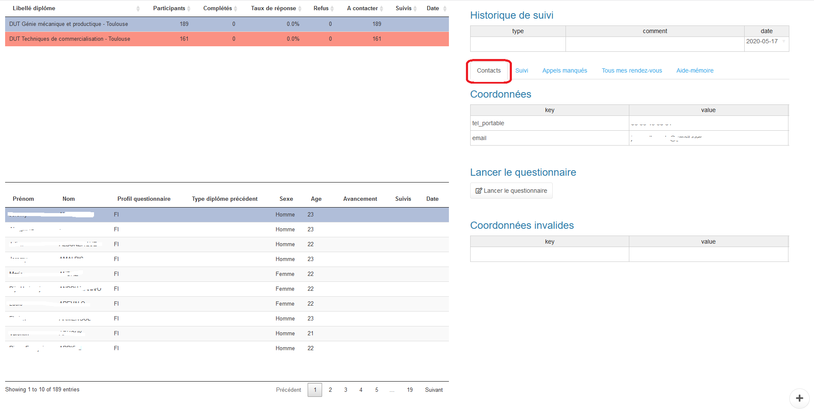
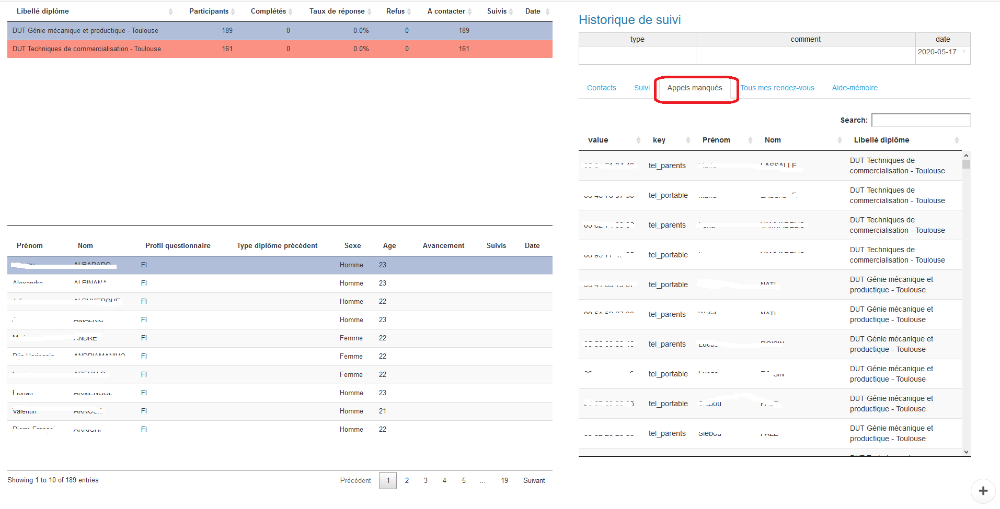

```{r setup, include = FALSE}
knitr::opts_chunk$set(
  collapse = TRUE,
  comment = "#>"
)
```

Il s'agit de l'interface pour les télé-enquêteurs dans leur travail de relance téléphonique.

Celle-ci est accessible par login/password définis dans le menu `Phoning team` de `survey.admin`.

# Utilisation

L'interface utilisateur du package se divise en trois sous-parties.

## 1. Groupes de participants

Ce tableau affiche les groupes de participants affectés au vacataire loggé.


Les premières colonnes correspondent aux champs `Attributes as group` configurés dans le menu `Phoning team` de `survey.admin`.


Les informations suivantes permettent de décrire les groupes de participants :

- `Participants` : Nombre de participants dans le groupe
- `Complétés` : Nombre de questionnaire remplis (`completed`)
- `Taux de réponse` : Ratio de répondants
- `Refus` : Nombre de refus de réponse (`optout`)
- `A contacter` : Nombre diplômés à contacter (`Participants` - `Complétés` - `Refus`)
- `Suivis` : Nombre de vagues complètes de relances effectuées
- `Date` : Date du dernier contact dans le groupe

## 2. Liste de participants

Ce tableau affiche les caractéristiques des participants du **groupe sélectionné**.


Les informations suivantes sont toujours afichées :

- `Prénom` : champ `firstname` de Limesurvey
- `Nom` : champ `lastname` de Limesurvey
- `Avancement` : Taux de remplissage du questionnaire s'il est incomplet
- `Suivis` : Nombre de suivi effectués pour le participant (dédoublonné par jour)
- `Date` : Date du dernier contact auprès du participant

Des champs supplémentaires peuvent être ajoutés en configurant `survey.admin` dans la section `Attributes as participants columns` du menu `Phoning team`.

Pour l'enquête d'insertion professionnelle, les champs suivants sont ajoutés car ils sont utiles pour la prise de contact et la passation du questionnaire :

- `Sexe` : lever l'ambiguité qui peut exister avec le prénom
- `Age`
- `Type de diplôme précédent`
- `Profil questionnaire` : type de questionnaire à venir (formation initiale ou continue)

## 3. Participant

Ce volet de l'interface affiche les suivis effectués pour le **participant sélectionné**.


### Historique de suivi

Un premier tableau référence par ordre chronologique les suivis effectués.


Plusieurs onglets permettent de gérer les différents évènement pouvant se produire pendant le suivi.

### Contacts

Le premier onglet présente les corrdonnées du participant afin de pouvoir le contater.



Deux tableaux séparés permettent de distinguer les coordonnées valides et invalides.
Ils sont éditables en fonction des appels passés.

Un bouton permet de lancer le questionnaire du participant en cours.

### Suivi de contact


Si le questionnaire n'a pas pu être passé, ce deuxième onglet permet de saisi le suivi de l'appel :

- `Répondeur` : message laissé
- `Faux numéro` : Vérification en direct avec la personne ou l'annonce de boite vocale
- `Pas de messagerie` : boite vocale pleine
- `Prender un rendez-vous` : il est possible de saisir un rendez-vous pour remplir le questionaire plus tard avec le télé-enquêteur
- `Email de relance` : le participant peut souhaiter recevoir un email de relance pour le remplir seul plus tard
- `Recherche Linkedin` : si le participant n'a pas de téléphone valide, on peut lancer une recherche Linkedin, ainsi qu'une invitation si la recherche aboutit
- `Refus de réponse` : si le participant ne souhaite pas répondre, on le verse en `optout` pour l'écarter de la liste des particpants à contacter

Pour chacune de  ces action le tableau su suivi se met à jour à jour automatiquement.

### Appels manqués

Un second appel peut être reçu pendant la passation d'un premier questionnaire.

Dans cet onglet, une recherche du numéro est possible dans le tableau des numéros de téléphone des particicpants.



### Rendez-vous

La liste des rendez-vous planifiés est affichée dans cet onglet.


Par ailleurs, un rappel est automatiquement affiché dans les 5 minutes précédant un rendez-vous.

### Aide-mémoire

Un aide-mémoire peut être affiché dans ce dernier onglet.
Celui est configurable dans la section `Help text` du menu `Phoning team` de `survey.admin`.
